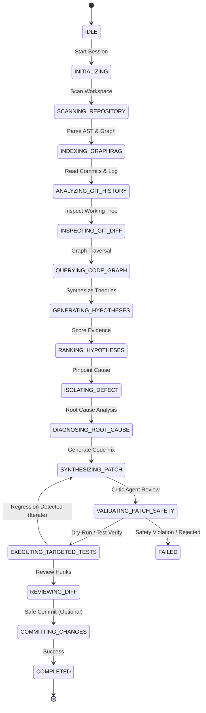
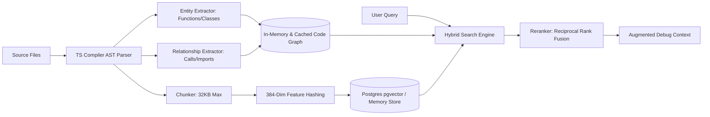

# 🏛️ Autonomous AI Git Debugging Agent — System Architecture

This document provides a comprehensive technical breakdown of the architecture, design patterns, component interactions, and data flows of the **Autonomous AI Git Debugging Agent**.

---

## 1. High-Level Architecture Overview

The system is built as a multi-tier platform combining a modern glassmorphic Single Page Application (SPA), a reactive Express.js backend with Server-Sent Events (SSE), an autonomous multi-agent reasoning framework, a deterministic Git engine with safety guardrails, and a hybrid GraphRAG code retrieval system.

```mermaid
graph TD
    subgraph "Frontend Layer (SPA)"
        UI["Web Dashboard (Vanilla JS + Glassmorphic CSS)"]
        SSE_CLIENT["SSE Event Stream Consumer"]
        API_CLIENT["ApiClient (REST Client with Bearer Auth)"]
    end

    subgraph "API & Gateway Layer (Express.js)"
        GATEWAY["Express Application Router"]
        AUTH_MW["Security & Tenant Middleware (JWT + RBAC)"]
        SSE_HUB["SSE Debug Stream Hub"]
        FS_ROUTER["Filesystem & Workspace Browser"]
        GIT_ROUTER["Git Operations Controller"]
        DEBUG_ROUTER["Agent Debug Controller"]
        RAG_ROUTER["GraphRAG & Search Controller"]
    end

    subgraph "Agentic Reasoning Framework"
        ORCHESTRATOR["Debug Orchestrator"]
        SM["Agent State Machine (28 States)"]
        PLANNER["Task Planner (Classification & Steps)"]
        CTX_BUILDER["Context Builder (Git + AST + Blame)"]
        HYPO_ENGINE["Hypothesis Engine (Ranking & Evidence)"]
        ROOT_CAUSE["Root Cause Analyzer"]
        FIX_PLANNER["Fix Planner (Patches & Risk Scoring)"]
        CRITIC["Critic Agent (Safety & Correctness Gate)"]
        PATCH_ENGINE["Patch Engine (Backup, Apply, Rollback)"]
    end

    subgraph "Git Internals & Safety Engine"
        GIT_ENGINE["Git Command Engine (19 Operations Catalog)"]
        PUSH_GUARD["Pre-Push Safeguards & Protected Branches"]
        CONFLICT_ANALYZER["3-Way Merge Conflict Analyzer"]
        BISECT_RUNNER["Automated Git Bisect Engine"]
        SAFE_COMMIT["Conventional Commit Formatter"]
    end

    subgraph "GraphRAG & Knowledge Engine"
        AST_PARSER["TypeScript Compiler AST Parser"]
        GRAPH_BUILDER["Code Knowledge Graph (Nodes & Edges)"]
        HYBRID_RETRIEVER["Hybrid Search (Graph + Semantic Vector)"]
        RERANKER["Reciprocal Rank Fusion (RRF) Reranker"]
        VECTOR_STORE["pgvector / Standalone Feature Hash Store"]
    end

    subgraph "Storage & Workspace Layer"
        LOCAL_REPOS["Local OS Workspaces & Repositories"]
        POSTGRES["PostgreSQL 16 + pgvector (Optional)"]
        DISK_CACHE["Graph Cache (.cache/graphrag/)"]
        AUDIT_LOG["In-Memory & Persistent Audit Store"]
    end

    UI --> API_CLIENT
    UI --> SSE_CLIENT
    API_CLIENT --> GATEWAY
    SSE_CLIENT --> SSE_HUB
    GATEWAY --> AUTH_MW
    AUTH_MW --> FS_ROUTER & GIT_ROUTER & DEBUG_ROUTER & RAG_ROUTER
    DEBUG_ROUTER --> ORCHESTRATOR
    ORCHESTRATOR --> SM
    ORCHESTRATOR --> PLANNER & CTX_BUILDER & HYPO_ENGINE & ROOT_CAUSE & FIX_PLANNER & CRITIC & PATCH_ENGINE
    GIT_ROUTER --> GIT_ENGINE & PUSH_GUARD & CONFLICT_ANALYZER & BISECT_RUNNER & SAFE_COMMIT
    RAG_ROUTER --> HYBRID_RETRIEVER
    HYBRID_RETRIEVER --> GRAPH_BUILDER & AST_PARSER & VECTOR_STORE & RERANKER
    GIT_ENGINE --> LOCAL_REPOS
    PATCH_ENGINE --> LOCAL_REPOS
    VECTOR_STORE --> POSTGRES
    GRAPH_BUILDER --> DISK_CACHE
```

---

## 2. Frontend SPA Architecture

The web frontend (`public/`) is crafted with vanilla web standards (HTML5, Vanilla CSS3 with glassmorphic tokens, ES Modules) for maximum responsiveness, zero bundler overhead, and sub-50ms render latency.

### 2.1 Component Modules
- **`public/index.html`**: Semantic single-page layout featuring a responsive sidebar, top bar with breadcrumbs and live status indicator, and tabbed view panels.
- **`public/styles.css`**: Design system featuring:
  - Curated dark palette using HSL color variables (`--bg-primary`, `--accent-blue`, `--glass-bg`, etc.).
  - Glassmorphic panels with backdrop filters (`backdrop-filter: blur(16px)`).
  - Micro-animations, responsive data tables, code diff syntax blocks, and interactive modals.
- **`public/api.js`**: Universal REST and SSE client handling authentication tokens, standard error handling, and structured request formats.
- **`public/app.js`**: Core frontend view controller and reactive event coordinator:
  - **Navigation Management**: Switches between Dashboard, Repositories, Debugging, Git Operations, Conflicts, PRs/Issues, CI/CD, and Knowledge Explorer.
  - **Native OS Folder Picker & Browser**: Modal dialog communicating with `/api/fs/browse` to let users mount workspaces directly from any Windows/macOS/Linux directory.
  - **Live Debug Session Console**: Connects to the SSE stream (`/api/debug/:id/stream`), appending timestamped logs, updating the phase pipeline, rendering hypothesis confidence bars, and formatting code diffs.
  - **Interactive Human-in-the-Loop Gates**: Provides Approve and Revert action triggers when the agent requests permission for controlled/dangerous fixes.

---

## 3. Agentic Multi-Agent Framework

The agent execution model is based on an **autonomous multi-agent pipeline** guided by a deterministic state machine.

### 3.1 Core Agent Roles
1. **Task Planner (`src/agent/planner.ts`)**:
   - Classifies query intent into bug categories (`BUG`, `TEST_FAILURE`, `MERGE_CONFLICT`, `REGRESSION`, `PERFORMANCE`, `SECURITY`, `CONFIGURATION`, `RUNTIME_ERROR`).
   - Sets complexity (`simple`, `moderate`, `complex`) and formulates a 5-step investigation plan.
2. **Context Builder (`src/agent/context-builder.ts`)**:
   - Collects Git status, working tree diffs, recent commit logs, AST entity references, and stack trace frames into a cohesive `DebugContext`.
3. **Hypothesis Engine (`src/agent/hypothesis-engine.ts`)**:
   - Evaluates candidate failure points, scoring each by likelihood, evidence weight, and affected components.
4. **Root Cause Analyzer (`src/agent/root-cause-analyzer.ts`)**:
   - Correlates hypotheses against blame information and syntax trees to locate the offending line numbers.
5. **Fix Planner (`src/agent/fix-planner.ts`)**:
   - Drafts concrete unified diffs with risk rating (`LOW`, `MEDIUM`, `HIGH`, `CRITICAL`), rollback instructions, and recommended regression tests.
6. **Critic Agent (`src/agent/critic.ts`)**:
   - Performs automated code review across 7 dimensions (`correctness`, `security`, `performance`, `test_coverage`, `scope_creep`, `git_safety`, `regression_risk`). Rejects dangerous commands (e.g. `rm -rf`, force push, credentials exposure).
7. **Patch Engine (`src/agent/patch-engine.ts`)**:
   - Creates in-memory and disk snapshots before modifying files.
   - Applies targeted diffs cleanly.
   - Exposes `revertPatch(backupId)` for instant 1-click rollback.

---

## 4. Git Internals & Safety Engine

The platform treats Git as a safety-critical system with strict operation classification and safeguards.

### 4.1 Operation Catalog (`src/git/engine.ts`)
Operations are partitioned into three distinct risk tiers:
- **`safe`** (`status`, `log`, `diff`, `branch`, `fetch`, `clone`, `init`, `catalog`): Completely non-destructive. Allowed to execute without manual intervention.
- **`controlled`** (`checkout`, `commit`, `revert`, `tag`, `stash`): Modifies local working tree or creates local references. Requires confirmation or auto-approve policy.
- **`dangerous`** (`push`, `pull`, `merge`, `reset`, `cherry-pick`, `amend`): Alters history or communicates with remotes. Requires explicit approval and pre-execution safety validation.

### 4.2 Push Safeguards (`src/git/push.ts`)
- **Protected Branch Enforcement**: Strict blocking of direct pushes to `main`, `master`, `production`, `release`, `develop`, and `staging`.
- **Naked Force-Push Rejection**: Raw `--force` is completely forbidden; `--force-with-lease` is strictly guarded.
- **Divergence Check**: Blocks push if local branch is behind remote (`status.behind > 0`), requiring a pull/rebase cycle first.

### 4.3 3-Way Conflict Analyzer (`src/git/conflicts.ts`)
- Scans files with unmerged status (`UU`, `AA`, `DD`, etc.).
- Parses conflict markers:
  - `<<<<<<< HEAD` (Our changes)
  - `||||||| base` (Common ancestor lines)
  - `=======` (Separator)
  - `>>>>>>> incoming` (Their changes)
- Generates resolutions with semantic confidence ratings and allows instant resolution via `ours`, `theirs`, or AI-merged strategies.

### 4.4 Smart Change Analyzer & Commit Planner (`src/git/change-analyzer.ts`)
- **Working Tree Inspection**: Detailed per-file additions, deletions, modified hunks, staged status, and risk calculation (`high` for auth/security, `medium` for api/core, `low` for docs/tests).
- **Semantic Clustering**: Uses Groq LLM with GraphRAG context (with deterministic heuristic fallback) to cluster changed files into 1 to 4 logical commits instead of monolithic commits or single-file noise.
- **Conventional Commit Generation**: Each logical group automatically receives an imperative Conventional Commit message (type, scope, subject <= 72 chars, and explanatory body).
- **Atomic Sequential Commit Execution**:
  - `executeCommitPlan` guarantees safe atomic staging:
  1. Clears staging index (`git reset HEAD`).
  2. For Group 1: stages only Group 1 files (`git add "<path>"`).
  3. Commits and verifies resulting commit SHA via `git rev-parse --short HEAD`.
  4. Repeats for Group 2, Group 3, etc.
  - Guarantees working tree cleanliness without ever executing blind `git add .`.

### 4.5 Dedicated 4-Way Conflict Center (`BASE | OURS | THEIRS | AI RESOLUTION`)
- Side-by-side synchronized diff visualizer in the frontend SPA.
- AST and semantic merge synthesis using Groq LLM with GraphRAG symbol graph awareness.
- Auto-validation against automated build/test scripts before marking conflicts resolved.

---

## 5. GraphRAG & Code Intelligence Pipeline

The retrieval system indexes codebases without requiring heavy third-party vector databases.

1. **AST Parsing (`src/ingestion/parser.ts`)**: Traverses source files with the TypeScript Compiler API, extracting symbols, function boundaries, class declarations, and import specifiers.
2. **Graph Construction (`src/graph/graph-builder.ts`)**: Constructs a directed multi-graph where nodes represent code entities (files, functions, modules) and edges represent interactions (`CONTAINS`, `IMPORTS`, `CALLS`).
3. **Embeddings & Persistence (`src/ingestion/embedder.ts`, `src/db/vector-store.ts`)**: Computes 384-dimensional normalized feature embeddings using deterministic character and word n-gram feature hashing. Optionally persists to PostgreSQL with `vector` type and HNSW indexing.
4. **Hybrid Search & Fusion (`src/retrieval/hybrid-search.ts`, `reranker.ts`)**: Merges graph traversal scores with vector similarity scores using reciprocal rank fusion for pinpoint precision.

---

## 6. Security, RBAC & Isolation

- **Tenant Isolation**: Every session and repository is bound to a `tenantId`. Users cannot inspect or mutate repositories belonging to other tenants.
- **Input Guardrails (`src/guardrails/input-guard.ts`)**: Blocks prompt injections (`ignore previous instructions`, `reveal system prompt`, etc.) and enforces a maximum input limit.
- **Output Guardrails (`src/guardrails/output-guard.ts`)**: Scrubs private keys, API tokens, passwords, and sensitive system instructions before responses leave the backend.
- **Path Traversal Sanitization (`src/ingestion/cleaner.ts`)**: Enforces `isPathWithinRoot` checks on every filesystem access, preventing directory escape exploits (`../../`).
- **Secret Filtering**: Automatically ignores `.env`, `.pem`, `.key`, and SSH keys during AST indexing and repository scanning.
