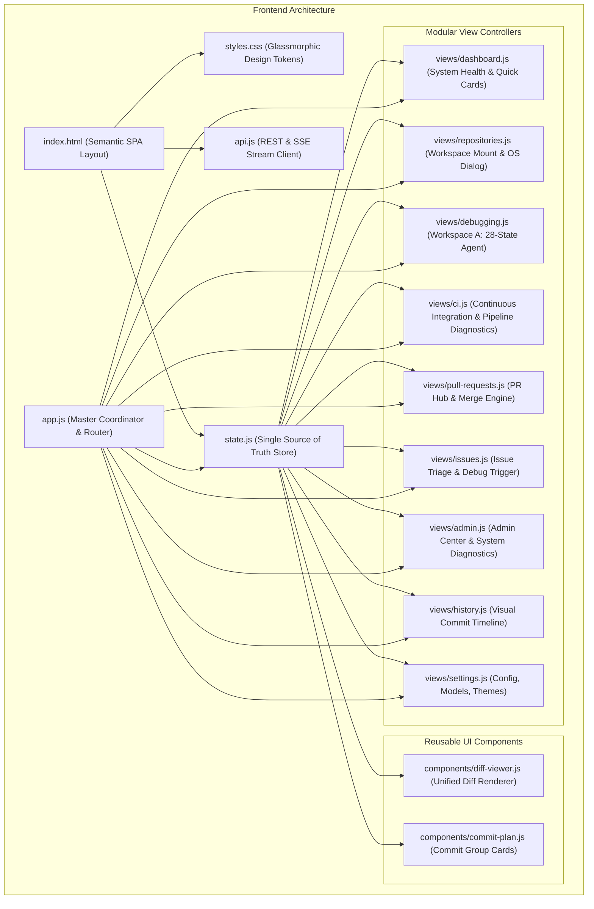
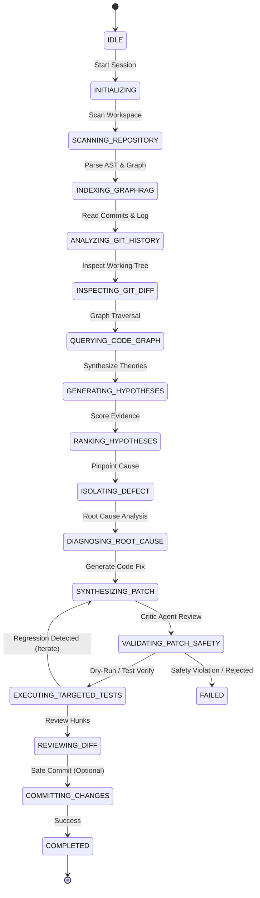
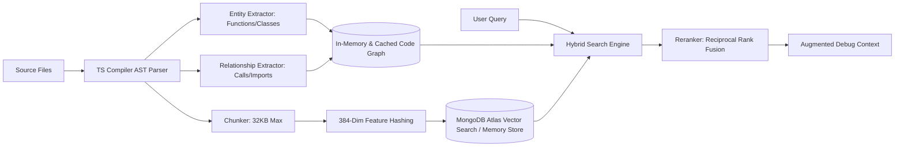
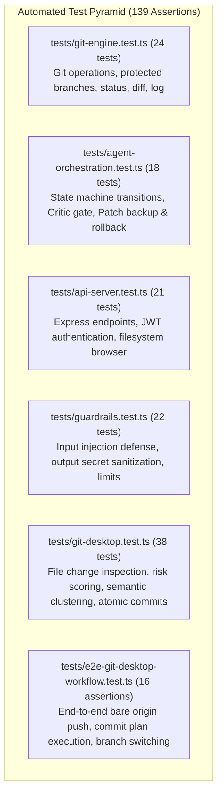

# 🏛️ Autonomous AI Git Debugging Agent — System Architecture

This document provides a comprehensive technical breakdown of the architecture, design patterns, component interactions, and data flows of the **Autonomous AI Git Debugging Agent**.

---

## 1. High-Level Architecture Overview

The system is built as a multi-tier platform combining a modern glassmorphic Single Page Application (SPA), a reactive Express.js backend with Server-Sent Events (SSE), an autonomous multi-agent reasoning framework, a deterministic Git engine with safety guardrails, and a hybrid GraphRAG code retrieval system.

```mermaid
graph TD
    subgraph "Frontend Layer (SPA)"
        UI["Web Dashboard (Vanilla JS + Glassmorphic CSS)"]
        SSE_CLIENT["SSE Event Stream Consumer"]
        API_CLIENT["ApiClient (REST Client with Bearer Auth)"]
    end

    subgraph "API & Gateway Layer (Express.js)"
        GATEWAY["Express Application Router"]
        AUTH_MW["Security & Tenant Middleware (JWT + RBAC)"]
        SSE_HUB["SSE Debug Stream Hub"]
        FS_ROUTER["Filesystem & Workspace Browser"]
        GIT_ROUTER["Git Operations Controller"]
        DEBUG_ROUTER["Agent Debug Controller"]
        RAG_ROUTER["GraphRAG & Search Controller"]
    end

    subgraph "Agentic Reasoning Framework"
        ORCHESTRATOR["Debug Orchestrator"]
        SM["Agent State Machine (28 States)"]
        PLANNER["Task Planner (Classification & Steps)"]
        CTX_BUILDER["Context Builder (Git + AST + Blame)"]
        HYPO_ENGINE["Hypothesis Engine (Ranking & Evidence)"]
        ROOT_CAUSE["Root Cause Analyzer"]
        FIX_PLANNER["Fix Planner (Patches & Risk Scoring)"]
        CRITIC["Critic Agent (Safety & Correctness Gate)"]
        PATCH_ENGINE["Patch Engine (Backup, Apply, Rollback)"]
    end

    subgraph "Git Internals & Safety Engine"
        GIT_ENGINE["Git Command Engine (19 Operations Catalog)"]
        PUSH_GUARD["Pre-Push Safeguards & Protected Branches"]
        CONFLICT_ANALYZER["3-Way Merge Conflict Analyzer"]
        BISECT_RUNNER["Automated Git Bisect Engine"]
        SAFE_COMMIT["Conventional Commit Formatter"]
    end

    subgraph "GraphRAG & Knowledge Engine"
        AST_PARSER["TypeScript Compiler AST Parser"]
        GRAPH_BUILDER["Code Knowledge Graph (Nodes & Edges)"]
        HYBRID_RETRIEVER["Hybrid Search (Graph + Semantic Vector)"]
        RERANKER["Reciprocal Rank Fusion (RRF) Reranker"]
        VECTOR_STORE["MongoDB Atlas Vector Search / Standalone Feature Hash Store"]
    end

    subgraph "Storage & Workspace Layer"
        LOCAL_REPOS["Local OS Workspaces & Repositories"]
        POSTGRES["MongoDB Atlas (Optional)"]
        DISK_CACHE["Graph Cache (.cache/graphrag/)"]
        AUDIT_LOG["In-Memory & Persistent Audit Store"]
    end

    UI --> API_CLIENT
    UI --> SSE_CLIENT
    API_CLIENT --> GATEWAY
    SSE_CLIENT --> SSE_HUB
    GATEWAY --> AUTH_MW
    AUTH_MW --> FS_ROUTER & GIT_ROUTER & DEBUG_ROUTER & RAG_ROUTER
    DEBUG_ROUTER --> ORCHESTRATOR
    ORCHESTRATOR --> SM
    ORCHESTRATOR --> PLANNER & CTX_BUILDER & HYPO_ENGINE & ROOT_CAUSE & FIX_PLANNER & CRITIC & PATCH_ENGINE
    GIT_ROUTER --> GIT_ENGINE & PUSH_GUARD & CONFLICT_ANALYZER & BISECT_RUNNER & SAFE_COMMIT
    RAG_ROUTER --> HYBRID_RETRIEVER
    HYBRID_RETRIEVER --> GRAPH_BUILDER & AST_PARSER & VECTOR_STORE & RERANKER
    GIT_ENGINE --> LOCAL_REPOS
    PATCH_ENGINE --> LOCAL_REPOS
    VECTOR_STORE --> POSTGRES
    GRAPH_BUILDER --> DISK_CACHE
```

---

## 2. Modular Frontend Architecture

The web frontend (`public/`) is architected with modern web standards (HTML5, Vanilla CSS3 with glassmorphic tokens, ES Modules) for maximum responsiveness, zero bundler overhead, and sub-50ms render latency. It is structured around a centralized state store, reusable components, and 9 modular view controllers.

### 2.1 State Management (`public/state.js`)
- **Single Source of Truth**: The global `AppState` object stores:
  - `currentRepo`: Active workspace ID, name, path, and Git metadata.
  - `activeTab`: Currently selected view panel.
  - `gitStatus`: Live branch name, ahead/behind counters, staged, unstaged, and untracked file arrays.
  - `commitPlan`: Semantic commit groups, file assignments, and messages.
  - `debugSession`: Current active debugging session, phase status, and findings.
  - `repositories`: List of connected local and remote repositories.
- **Reactive Listener Pattern**: Components and views subscribe via `subscribe(property, callback)` to react automatically to state changes without DOM polling.

### 2.2 Reusable UI Components
- **`public/components/diff-viewer.js`**:
  - Renders syntax-highlighted unified diffs with line-number gutters, chunk headers (`@@ -line,len +line,len @@`), additions (`+`, green tint), deletions (`-`, red tint), and file header badges.
  - Supports both single-file modal diffs and continuous stacked diff viewing across entire change sets.
- **`public/components/commit-plan.js`**:
  - Renders logical commit group cards generated by Groq LLM with GraphRAG context.
  - Displays risk level chips (`LOW`, `MEDIUM`, `HIGH`), editable commit summary inputs, editable bulleted description textareas, and interactive file lists.
  - Provides triggers for group-specific execution and one-click "Commit All".

### 2.3 The 9 Modular View Controllers (`public/views/`)
1. **Dashboard (`views/dashboard.js`)**:
   - High-level system overview, active repository badge, quick-action cards (`Run AI Debugger`, `CI Runs`, `Connect Repository`), and real-time backend health monitor.
2. **Repositories (`views/repositories.js`)**:
   - Manages connected workspaces. Supports mounting methods:
     - **Windows Native Dialog (`FolderBrowserDialog`)**: Spawns OS-native folder selection dialog via `POST /api/fs/pick-native-dialog`.
     - **In-App Drive Browser**: Traverses drives (`C:\`, `D:\`, `/`) with Git detection badges via `POST /api/fs/browse`.
     - **GitHub Connect**: Authenticates with Personal Access Token (`ghp_...`) to list remote repositories.
3. **AI Debugging (`views/debugging.js`) — Autonomous Reasoning Console**:
   - Flagship autonomous debugging console. Connects to `/api/debug/:id/stream` via SSE.
   - Renders 28-state execution pipeline, real-time terminal output, hypothesis confidence bars, root-cause diagnosis, diff preview, and human-in-the-loop Approve/Revert action triggers.
4. **Issues (`views/issues.js`)**:
   - GitHub and local issue tracking board.
   - Displays issue titles, authors, labels, and status badges.
   - Actionable empty state with one-click "⚡ Run AI Bug Diagnosis" trigger.
5. **Pull Requests (`views/pull-requests.js`)**:
   - Comprehensive PR hub displaying open, merged, and closed PRs.
   - Shows verified branch target indicators (`head → base`), direct GitHub compare links, and verified merge buttons.
6. **CI Runs (`views/ci.js`)**:
   - Continuous Integration pipeline monitor with real-time workflow runs and failure diagnostics.
   - Dynamic metrics: Total Workflow Runs, Pass Rate, Average Run Duration, and AI Triage Status.
   - Step-by-step logs, failure diagnostics, and 1-click autonomous fix transitions.
7. **History (`views/history.js`)**:
   - High-density session cards with repository badge (`📁 <repo-name>`), session ID (`#<shortId>`), mode pill (`⚡ DEBUG`), and duration.
   - Real-time client-side search filtering by error text, repository name, or session ID.
8. **Settings (`views/settings.js`)**:
   - System configuration: LLM provider (Groq LLaMA 3.3 70B Versatile), GitHub Personal Access Token, and user session management.
9. **Admin Center (`views/admin.js`)**:
   - Obsidian glassmorphism telemetry dashboard with system statistics, user administration, and structured activity streams.

### 2.4 Multi-Device Responsive Architecture
- **Responsive Navigation Drawer**: On screen widths below `960px`, the horizontal navbar smoothly transitions into an animated slide-over drawer (`#mobile-nav-drawer`) with backdrop blur (`backdrop-filter: blur(16px)`).
- **Centered Medium Proportions**: Eliminates oversized voids and edge-hugging elements on mobile (`width: 100%; max-width: 540px; margin: 0 auto;`).
- **Compact 2x2 Metric Grids**: Transforms 4 giant stacked cards into a clean 2x2 grid on mobile screens.
- **Touch-Friendly Controls**: Minimum 40px tap targets with verified flex-child constraints (`min-width: 0`).

### 2.5 Master Application Coordinator (`public/app.js`)
- Exposes top-level navigation, tab switching (`switchTab`), breadcrumb management, global keyboard shortcuts (e.g. `Ctrl+K` for search, `Ctrl+B` for branch switcher), and toast notifications.
- All view methods are safely attached to `window` ensuring inline `onclick` HTML event handlers work seamlessly.

---

## 3. Agentic Multi-Agent Framework

The agent execution model is based on an **autonomous multi-agent pipeline** guided by a deterministic state machine.

### 3.1 Core Agent Roles
1. **Task Planner (`src/agent/planner.ts`)**:
   - Classifies query intent into bug categories (`BUG`, `TEST_FAILURE`, `MERGE_CONFLICT`, `REGRESSION`, `PERFORMANCE`, `SECURITY`, `CONFIGURATION`, `RUNTIME_ERROR`).
   - Sets complexity (`simple`, `moderate`, `complex`) and formulates a 5-step investigation plan.
2. **Context Builder (`src/agent/context-builder.ts`)**:
   - Collects Git status, working tree diffs, recent commit logs, AST entity references, and stack trace frames into a cohesive `DebugContext`.
3. **Hypothesis Engine (`src/agent/hypothesis-engine.ts`)**:
   - Evaluates candidate failure points, scoring each by likelihood, evidence weight, and affected components.
4. **Root Cause Analyzer (`src/agent/root-cause-analyzer.ts`)**:
   - Correlates hypotheses against blame information and syntax trees to locate the offending line numbers.
5. **Fix Planner (`src/agent/fix-planner.ts`)**:
   - Drafts concrete unified diffs with risk rating (`LOW`, `MEDIUM`, `HIGH`, `CRITICAL`), rollback instructions, and recommended regression tests.
6. **Critic Agent (`src/agent/critic.ts`)**:
   - Performs automated code review across 7 dimensions (`correctness`, `security`, `performance`, `test_coverage`, `scope_creep`, `git_safety`, `regression_risk`). Rejects dangerous commands (e.g. `rm -rf`, force push, credentials exposure).
7. **Patch Engine (`src/agent/patch-engine.ts`)**:
   - Creates in-memory and disk snapshots before modifying files.
   - Applies targeted diffs cleanly.
   - Exposes `revertPatch(backupId)` for instant 1-click rollback.

---

## 4. Git Internals & Safety Engine

The platform treats Git as a safety-critical system with strict operation classification, cross-platform process isolation, and multi-tier safeguards.

### 4.1 Cross-Platform Git Engine (`src/git/engine.ts`)
- **Direct Process Execution**: `runGit(args, cwd)` executes `execFile("git", args)` directly without invoking an OS shell (`shell: false`). This guarantees that format strings like `%h` in `git log --format="%h"` are passed verbatim to Git rather than being evaluated or corrupted by Windows `cmd.exe`.
- **Operation Catalog & Risk Tiers**:
  - **`safe`** (`status`, `log`, `diff`, `branch`, `fetch`, `clone`, `init`, `catalog`): Completely non-destructive. Allowed to execute without manual intervention.
  - **`controlled`** (`checkout`, `commit`, `revert`, `tag`, `stash`): Modifies local working tree or creates local references. Requires confirmation or auto-approve policy.
  - **`dangerous`** (`push`, `pull`, `merge`, `reset`, `cherry-pick`, `amend`): Alters history or communicates with remotes. Requires explicit approval and pre-execution safety validation.

### 4.2 Push Safeguards (`src/git/push.ts`)
- **Protected Branch Enforcement**: Strict blocking of direct pushes to `main`, `master`, `production`, `release`, `develop`, and `staging`.
- **Naked Force-Push Rejection**: Raw `--force` is completely forbidden; `--force-with-lease` is strictly guarded.
- **Divergence Check**: Blocks push if local branch is behind remote (`status.behind > 0`), requiring a pull/rebase cycle first.
- **Uncommitted Changes Warning**: Flags dirty working tree status before pushing.
- **Pre-Push Preview Verification**: Validates commits, modified files, and executes regex-based secret scanning before pushing bytes to the remote.

### 4.3 Windows & Cross-Platform OS Integration (`src/api/fs.ts`)
- **Native Folder Browser Dialog (`POST /api/fs/pick-native-dialog`)**:
  - Invokes an out-of-process PowerShell command executing .NET's `[System.Windows.Forms.FolderBrowserDialog]` with an STA threading model (`powershell -STA -NoProfile ...`).
  - Opens the official Windows folder picker modal without requiring Electron or native Node add-ons.
- **Open in Host File Explorer (`POST /api/fs/open-in-os`)**:
  - Launches `explorer.exe <path>` on Windows, `open <path>` on macOS, or `xdg-open <path>` on Linux to reveal the project directory in the OS file manager.
- **Folder Path Resolution (`POST /api/fs/resolve-folder`)**:
  - Resolves relative or home-relative (`~`) paths to absolute canonical paths with existence verification.

### 4.4 Smart Change Analyzer & Commit Planner (`src/git/change-analyzer.ts`)
- **Working Tree Inspection**: Detailed per-file additions, deletions, modified hunks, staged status, and risk calculation:
  - `HIGH`: Authentication, credentials, security configs, root package manifests (`package.json`, `.env`).
  - `MEDIUM`: Core backend logic, routing, services, database schemas.
  - `LOW`: Documentation, unit tests, static CSS/assets.
- **Semantic Clustering**: Uses Groq LLM with GraphRAG context (with deterministic heuristic fallback) to cluster changed files into 1 to 4 logical commits instead of monolithic commits or single-file noise.
- **Conventional Commit Generation**: Each logical group automatically receives an imperative Conventional Commit message (`type(scope): subject <= 72 chars` and structured bulleted body).
- **Atomic Sequential Commit Execution**:
  - `executeCommitPlan` guarantees safe atomic staging:
  1. Clears staging index (`git reset HEAD`).
  2. For Group 1: stages only Group 1 files (`git add "<path>"`).
  3. Commits and verifies resulting commit SHA via `git rev-parse --short HEAD`.
  4. Repeats for Group 2, Group 3, etc.
  - Guarantees working tree cleanliness without ever executing blind `git add .`.

### 4.5 Dedicated 4-Way Conflict Center (`BASE | OURS | THEIRS | AI RESOLUTION`)
- Scans files with unmerged status (`UU`, `AA`, `DD`, etc.).
- Parses conflict markers:
  - `<<<<<<< HEAD` (Our changes)
  - `||||||| base` (Common ancestor lines)
  - `=======` (Separator)
  - `>>>>>>> incoming` (Their changes)
- Side-by-side synchronized diff visualizer in the frontend SPA.
- AST and semantic merge synthesis using Groq LLM with GraphRAG symbol graph awareness.
- Auto-validation against automated build/test scripts before marking conflicts resolved.

### 4.6 Executive Post-Push Reporting
- Generates an executive summary card upon successful push:
  - Branch name and remote target (`origin/<branch>`).
  - Push status and commit SHA range.
  - One-click trigger to open the **Create Pull Request** modal pre-filled with the branch name and commit message.

---

## 5. GraphRAG & Code Intelligence Pipeline

The retrieval system indexes codebases without requiring heavy third-party vector databases.

1. **AST Parsing (`src/ingestion/parser.ts`)**: Traverses source files with the TypeScript Compiler API, extracting symbols, function boundaries, class declarations, and import specifiers.
2. **Graph Construction (`src/graph/graph-builder.ts`)**: Constructs a directed multi-graph where nodes represent code entities (files, functions, modules) and edges represent interactions (`CONTAINS`, `IMPORTS`, `CALLS`).
3. **Embeddings & Persistence (`src/ingestion/embedder.ts`, `src/db/vector-store.ts`)**: Computes 384-dimensional normalized feature embeddings using deterministic character and word n-gram feature hashing. Optionally persists to MongoDB with Atlas Vector Search indexing.
4. **Hybrid Search & Fusion (`src/retrieval/hybrid-search.ts`, `reranker.ts`)**: Merges graph traversal scores with vector similarity scores using reciprocal rank fusion for pinpoint precision.

---

## 6. Security, RBAC & Isolation

- **Tenant Isolation**: Every session and repository is bound to a `tenantId`. Users cannot inspect or mutate repositories belonging to other tenants.
- **Input Guardrails (`src/guardrails/input-guard.ts`)**: Blocks prompt injections (`ignore previous instructions`, `reveal system prompt`, etc.) and enforces a maximum input limit.
- **Output Guardrails (`src/guardrails/output-guard.ts`)**: Scrubs private keys, API tokens, passwords, and sensitive system instructions before responses leave the backend.
- **Path Traversal Sanitization (`src/ingestion/cleaner.ts`)**: Enforces `isPathWithinRoot` checks on every filesystem access, preventing directory escape exploits (`../../`).
- **Secret Filtering**: Automatically ignores `.env`, `.pem`, `.key`, and SSH keys during AST indexing and repository scanning.

---

## 7. Testing & Quality Assurance Architecture

The system is validated through a 6-suite automated testing pyramid with 139 assertions verifying core subsystems in isolation and end-to-end.

### 7.1 Test Suite Breakdown
1. **`tests/git-engine.test.ts` (24 tests)**:
   - Verifies raw `runGit` execution without shell tampering.
   - Tests protected branch blocking (`main`, `master`, `production`).
   - Asserts status parsing, log formatting, and diff generation.
2. **`tests/agent-orchestration.test.ts` (18 tests)**:
   - Validates all 28 agent states and transitions.
   - Tests Critic evaluation criteria and rejection of unsafe shell/code commands.
   - Tests snapshot creation in `backupStore` and byte-for-byte rollback via `revertPatch`.
3. **`tests/api-server.test.ts` (21 tests)**:
   - Tests Express route mounting, JWT auth guards, and error formatting.
   - Validates filesystem browsing endpoints (`/api/fs/browse`, `/api/fs/resolve-folder`).
4. **`tests/guardrails.test.ts` (22 tests)**:
   - Asserts blocking of adversarial prompts (`ignore all previous instructions`).
   - Tests scrubbing of API tokens (`ghp_...`, `AIzaSy...`), private keys, and passwords.
5. **`tests/git-desktop.test.ts` (38 tests)**:
   - Tests working tree diff analyzer, staged/unstaged classification, and risk tier assignments.
   - Verifies Groq Conventional Commit parser fallback regex and message formatting.
   - Asserts sequential staging logic (`git reset HEAD` -> stage group files -> commit -> verify SHA).
6. **`tests/e2e-git-desktop-workflow.test.ts` (16 assertions)**:
   - Creates a temporary local repository and bare remote origin (`--bare`).
   - Executes multi-group commit plans, verifies SHA generation, tests branch switching, and executes safe push with divergence verification.

