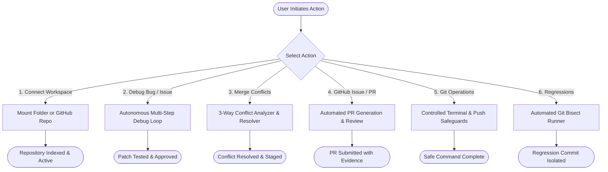
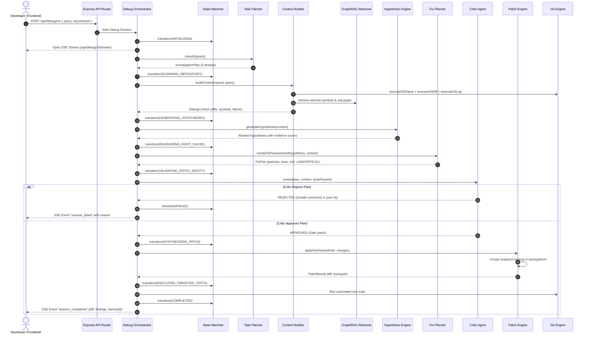
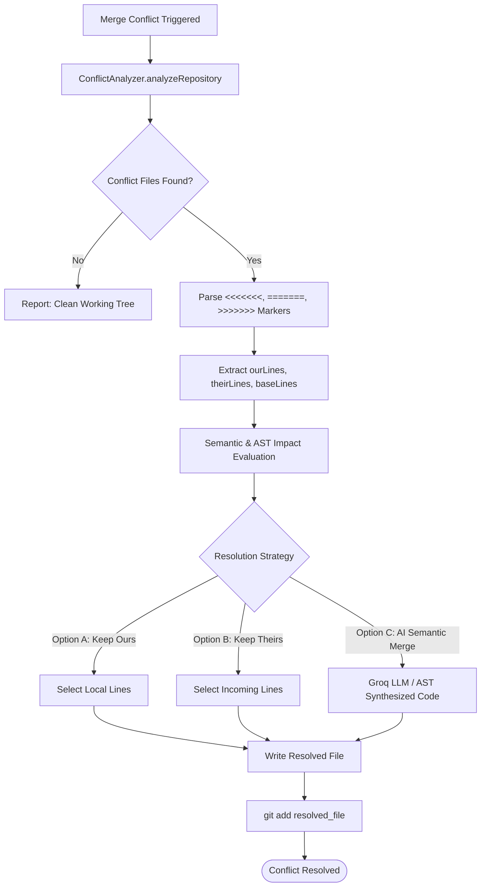
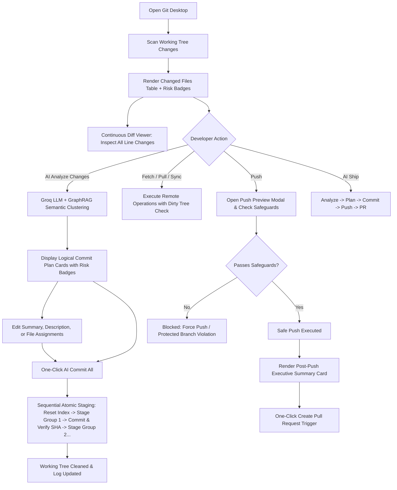
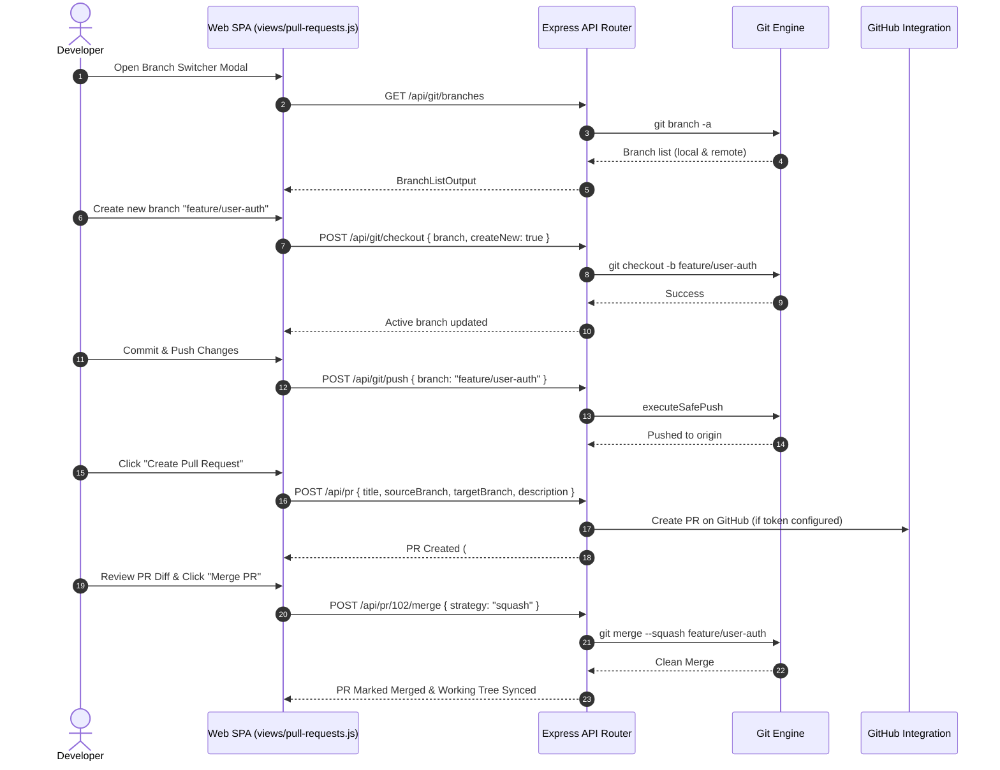
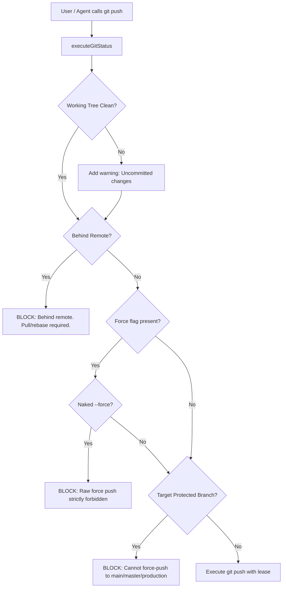

# 🔄 Autonomous AI Git Debugging Agent — Workflow Guide

This guide details the complete, end-to-end workflows of the Autonomous AI Git Debugging Agent platform. It explains exactly how the frontend and backend interact to resolve issues, pull requests, merge conflicts, and execute safe Git operations, along with instructions on where to modify code to customize system behavior.

---

## 1. Complete Workflow Directory

---

## 2. Workflow 1: Connecting Workspaces & Repositories

### Step-by-Step Flow:
1. **Frontend Interaction**:
   - The user opens the **Repositories** tab in the SPA.
   - The user can connect in three ways:
     - **Native OS Folder Picker**: Clicking "Browse Folder" opens the folder browser modal. The modal requests `/api/fs/browse` to inspect drives and directories (Windows drives `C:\`, `D:\`, or Unix root `/`), highlighting Git repositories with badges.
     - **Direct Path Entry**: Typing an absolute folder path (e.g. `C:\Users\username\Projects\my-app`) and clicking "Connect Local Repository".
     - **GitHub Connect**: Entering a GitHub Personal Access Token (`ghp_...`) to browse and clone remote repositories.
2. **Backend Processing (`src/api/repositories/connect.ts`)**:
   - Validates that the target path exists on the local filesystem.
   - Executes `git rev-parse --is-inside-work-tree` via `src/git/engine.ts` to confirm Git initialized status.
   - Extracts branch names, remote URLs, and current commit hash.
   - Registers repository in `repositoryStore` and returns repository metadata.
3. **Background GraphRAG Indexing (`src/graph/repository-indexer.ts`)**:
   - The repository is automatically scheduled for AST parsing and dependency graph extraction.

---

## 3. Workflow 2: Autonomous Bug & Issue Debugging

This is the flagship autonomous reasoning loop. It resolves software defects from natural language queries or error stack traces.

### Human-in-the-Loop Approval & Revert Protocol:
- If a patch has a `HIGH` or `CRITICAL` risk rating, the orchestrator pauses in state `REVIEWING_DIFF`.
- The frontend displays the unified diff viewer with highlighted additions and deletions.
- **Approve**: Clicking "Approve Fix" calls `POST /api/debug/:id/approve`, prompting the agent to commit the fix with a conventional commit message.
- **Revert**: Clicking "Revert Fix" calls `POST /api/debug/:id/revert`, invoking `revertPatch(backupId)` in `src/agent/patch-engine.ts`, restoring all modified files to their exact pre-patch byte state.

---

## 4. Workflow 3: 3-Way Merge Conflict Resolution

When merging branches or pulling from remotes results in merge conflicts, the agent resolves them automatically or semi-automatically.

### Steps:
1. User navigates to the **Conflicts** tab in the UI or triggers conflict resolution on a branch.
2. `src/git/conflicts.ts` runs `git status --porcelain`, identifying files marked with status codes `UU`, `AA`, `DD`, etc.
3. For each conflicted file, `ConflictAnalyzer.analyzeFile()` decomposes the conflict blocks into `ConflictMarker` objects.
4. The system renders the **4-Way Conflict Center (`BASE | OURS | THEIRS | AI RESOLUTION`)**:
   - `BASE`: Common ancestor version of the conflicting lines.
   - `OURS`: Current HEAD changes on the local branch.
   - `THEIRS`: Incoming changes from the target branch or remote.
   - `AI RESOLUTION`: Groq LLM + GraphRAG semantic merge that reconciles logic, resolves conflicting imports, and eliminates syntax breakage.
5. Developer can review side-by-side, click "Accept AI Resolution" or manually select "Accept Ours" / "Accept Theirs".
6. The engine writes the resolved file, runs `git add <file>`, and executes verification tests to ensure the working tree builds cleanly before concluding the merge.

---

## 5. Workflow 4: Git Desktop (Workspace B) & AI Semantic Commit Flow

Git Desktop provides a first-class visual repository controller powered by AI semantic code intelligence:

### Detailed Step-by-Step Flow:
1. **Working Tree Inspection**:
   - The UI automatically calls `GET /api/git/status?repositoryId=...` to retrieve working tree changes.
   - Files are categorized into **Staged**, **Unstaged**, and **Untracked**.
   - Each file receives an automated risk rating based on path inspection:
     - `HIGH` (red): Authentication, credentials, secrets, root manifests (`package.json`, `.env`).
     - `MEDIUM` (yellow): Backend services, API routes, database schemas, controllers.
     - `LOW` (green): Documentation, CSS styles, static assets, tests.
2. **Continuous Diff Viewer**:
   - Clicking "View All Diffs" or clicking any individual file row loads the unified diff via `/api/git/diff`.
   - Displays additions (`+`), deletions (`-`), chunk headers (`@@ ... @@`), and file paths in a high-performance stacked view.
3. **AI Change Analysis & Commit Planning**:
   - Clicking "AI Analyze Changes" sends the changed files and unified diffs to `POST /api/git/analyze-changes`.
   - The backend prompts the Groq LLM with GraphRAG entity context to cluster related files into 1 to 4 logical commits.
   - Each group receives an imperative Conventional Commit message (`type(scope): subject <= 72 chars`) and a detailed bulleted markdown description.
   - If the LLM is unreachable or unconfigured, a deterministic rule-based fallback partitions files by directory and file type.
4. **Interactive Commit Review & Customization**:
   - Commit cards are displayed with risk indicators, editable summary inputs, and editable bulleted descriptions.
   - Developers can review or edit commit messages before committing.
5. **Sequential Atomic Staging & Commit Execution**:
   - Clicking "Commit All Groups" or "Commit Group" calls `POST /api/git/commit-plan/execute`.
   - **Never Blind `git add .`**:
     1. Clears staging index via `git reset HEAD`.
     2. For each group, stages only that group's files via `git add "<file>"`.
     3. Commits with formatted message and extracts verified short SHA via `git rev-parse --short HEAD`.
     4. Advances to the next group until the working tree is clean.
6. **Remote Sync & Push Preview Modal**:
   - Clicking "Sync" fetches and pulls latest changes, verifying dirty-tree state before merging.
   - Clicking "Push" opens the **Push Preview Modal**:
     - Pre-push validator verifies the target branch is not protected (`main`, `master`, `production`).
     - Checks that local is not behind remote (`status.behind === 0`).
     - Scans commits and diffs for leaked secrets (API keys, private tokens).
     - Displays the exact list of commits and files that will be transmitted.
   - Clicking "Confirm & Push" executes `executeSafePush` with lease protection.
7. **Executive Post-Push Summary Card**:
   - Upon successful push, renders an executive summary card:
     - Remote branch link (`origin/feature/git-agent`).
     - Push timestamp and verified commit range.
     - One-click button "Create Pull Request" pre-filled with the branch name and commit message.

---

## 6. Workflow 5: Pull Request Lifecycle & Branch Management

The platform provides complete branch management and Pull Request creation/merging:

### Supported PR Capabilities:
1. **Branch Switching & Creation**:
   - View local and remote tracking branches.
   - Instant search filtering.
   - Dirty-tree protection: blocks checkout if uncommitted changes would conflict with the target branch.
2. **Pull Request Creation**:
   - Pre-fills PR title and description using AI Commit Plan summary and bulleted body.
   - Target branch selection (e.g. `development`, `main`).
   - Automated linkage to GitHub issues (`Closes #12`).
3. **Pull Request Review & Merge**:
   - Diff inspection of all commits in the PR.
   - 3 supported merge strategies:
     - `merge`: Creates a standard 3-way merge commit.
     - `squash`: Squashes all branch commits into a single clean commit.
     - `rebase`: Fast-forward rebase onto target branch.

---

## 7. Workflow 6: GitHub Issues & Autonomous Triage

1. **Issue Triage**:
   - The user connects GitHub on the **Issues** tab.
   - The agent fetches issues via `src/github/issues.ts`.
   - Clicking "Debug Issue" imports the issue title, body, and labels directly into the Autonomous Debugging Agent loop.
2. **Automated Fix & PR Creation**:
   - Once the fix is generated and verified, the user clicks "Create Pull Request".
   - `src/github/pull-requests.ts` creates a new branch (e.g., `fix/issue-104-null-pointer`).
   - Pushes the verified commit using `executeSafePush`.
   - Calls the GitHub API to open a Pull Request with an automated description detailing:
     - Root cause analysis summary.
     - Files modified with diff stats.
     - Test verification output.
     - Closes `#<issue_number>` keyword for auto-closing on merge.

---

## 8. Workflow 7: Controlled Git Operations & Push Safeguards

The platform acts as a secure Git controller preventing accidental repo corruption.

### Pre-Push Verification Flow (`src/git/push.ts`):

### Commit Formatting Flow (`src/git/commit.ts`):
- When committing changes, `formatCommitMessage` generates Conventional Commits:
  `fix(agent): resolve null pointer in token validation`
- Automatically extracts author attribution (`Harsh Pariya <hpariya195@gmail.com>`).
- Uses `git rev-parse --short HEAD` for deterministic commit hash tracking.

---

## 9. Workflow 8: Automated Git Bisect & Regression Pinpointing

When code breaks between two known revisions:
1. User provides a **Good Commit** (where behavior worked) and a **Bad Commit** (current regression).
2. `src/git/bisect.ts` starts an automated binary search session:
   - Executes `git bisect start <bad> <good>`.
   - At each midpoint commit, executes the user's automated test command (e.g. `npm test` or a custom test script).
   - Marks commit as `git bisect good` or `git bisect bad` based on the test exit code.
3. Automatically isolates the exact commit that introduced the failure, returning:
   - Culprit commit hash and author.
   - Commit message and date.
   - File diff associated with the regression.

---

## 10. Where to Modify Code (Customization Guide)

If you want to modify or extend the system, use this comprehensive reference:

| To Change... | Edit This File | What to Do |
| :--- | :--- | :--- |
| **Frontend Global State** | [`public/state.js`](file:///c:/Users/harsh/Desktop/Codage-tasks/ai-chatbot/public/state.js) | Add new reactive state variables, subscriptions, or initial defaults. |
| **Unified Diff Visualizer** | [`public/components/diff-viewer.js`](file:///c:/Users/harsh/Desktop/Codage-tasks/ai-chatbot/public/components/diff-viewer.js) | Customize diff hunk rendering, line number gutters, or continuous view mode. |
| **Commit Plan Cards** | [`public/components/commit-plan.js`](file:///c:/Users/harsh/Desktop/Codage-tasks/ai-chatbot/public/components/commit-plan.js) | Adjust group card layouts, risk badge colors, or commit action buttons. |
| **Dashboard View** | [`public/views/dashboard.js`](file:///c:/Users/harsh/Desktop/Codage-tasks/ai-chatbot/public/views/dashboard.js) | Modify dashboard metrics, active repo card, or system health gauges. |
| **Repository Management View** | [`public/views/repositories.js`](file:///c:/Users/harsh/Desktop/Codage-tasks/ai-chatbot/public/views/repositories.js) | Customize native folder picker modal, GitHub connector, or repo cards. |
| **AI Debugging Console (Workspace A)** | [`public/views/debugging.js`](file:///c:/Users/harsh/Desktop/Codage-tasks/ai-chatbot/public/views/debugging.js) | Modify SSE log streaming, hypothesis meters, or Approve/Revert triggers. |
| **Git Desktop Controller (Workspace B)** | [`public/views/git-desktop.js`](file:///c:/Users/harsh/Desktop/Codage-tasks/ai-chatbot/public/views/git-desktop.js) | Adjust change tables, branch switcher, push preview modal, or post-push summary card. |
| **Pull Requests Hub** | [`public/views/pull-requests.js`](file:///c:/Users/harsh/Desktop/Codage-tasks/ai-chatbot/public/views/pull-requests.js) | Modify PR lists, create PR modal, or merge strategy options. |
| **Issue Triage View** | [`public/views/issues.js`](file:///c:/Users/harsh/Desktop/Codage-tasks/ai-chatbot/public/views/issues.js) | Customize issue filters, label tags, or one-click "Debug Issue" action. |
| **4-Way Conflict Center** | [`public/views/conflicts.js`](file:///c:/Users/harsh/Desktop/Codage-tasks/ai-chatbot/public/views/conflicts.js) | Adjust side-by-side 4-way editor, AI resolution selector, or test runners. |
| **Commit History Timeline** | [`public/views/history.js`](file:///c:/Users/harsh/Desktop/Codage-tasks/ai-chatbot/public/views/history.js) | Modify commit list rendering, author badges, or diff popups. |
| **Settings & Diagnostics** | [`public/views/settings.js`](file:///c:/Users/harsh/Desktop/Codage-tasks/ai-chatbot/public/views/settings.js) | Add configuration options, LLM model switches, or cache clear actions. |
| **Master Navigation & Router** | [`public/app.js`](file:///c:/Users/harsh/Desktop/Codage-tasks/ai-chatbot/public/app.js) | Adjust keyboard shortcuts, tab switching, or global notification toasts. |
| **CSS Theme & Glassmorphic Tokens** | [`public/styles.css`](file:///c:/Users/harsh/Desktop/Codage-tasks/ai-chatbot/public/styles.css) | Modify HSL color tokens, backdrop filters, typography, or responsive rules. |
| **HTML Shell & Modal Skeletons** | [`public/index.html`](file:///c:/Users/harsh/Desktop/Codage-tasks/ai-chatbot/public/index.html) | Add new modals, top navigation buttons, or sidebar menu items. |
| **Express API Routing & Middleware** | [`src/app.ts`](file:///c:/Users/harsh/Desktop/Codage-tasks/ai-chatbot/src/app.ts) | Register new API routes, JWT security middleware, or error handlers. |
| **Native OS Dialogs & File Ops** | [`src/api/fs.ts`](file:///c:/Users/harsh/Desktop/Codage-tasks/ai-chatbot/src/api/fs.ts) | Tweak PowerShell `FolderBrowserDialog` or OS file manager launchers. |
| **Git Engine & Windows execFile** | [`src/git/engine.ts`](file:///c:/Users/harsh/Desktop/Codage-tasks/ai-chatbot/src/git/engine.ts) | Adjust Git command executions, risk classifications, or formatting flags. |
| **Push Safeguards & Branch Protection** | [`src/git/push.ts`](file:///c:/Users/harsh/Desktop/Codage-tasks/ai-chatbot/src/git/push.ts) | Add protected branch patterns or modify force-push lease checks. |
| **AI Commit Clustering & Messages** | [`src/git/change-analyzer.ts`](file:///c:/Users/harsh/Desktop/Codage-tasks/ai-chatbot/src/git/change-analyzer.ts) | Tune Groq Conventional Commit prompts or regex fallback clustering. |
| **Agent State Machine & Planner** | [`src/agent/planner.ts`](file:///c:/Users/harsh/Desktop/Codage-tasks/ai-chatbot/src/agent/planner.ts) | Customize investigation phases, bug classifiers, or step sequences. |
| **Critic Agent Review Gates** | [`src/agent/critic.ts`](file:///c:/Users/harsh/Desktop/Codage-tasks/ai-chatbot/src/agent/critic.ts) | Modify scoring thresholds, security criteria, or forbidden commands. |
| **Patch Engine & Instant Rollback** | [`src/agent/patch-engine.ts`](file:///c:/Users/harsh/Desktop/Codage-tasks/ai-chatbot/src/agent/patch-engine.ts) | Adjust file snapshot storage or patch application algorithms. |
| **GraphRAG Code Retrieval** | [`src/retrieval/retriever.ts`](file:///c:/Users/harsh/Desktop/Codage-tasks/ai-chatbot/src/retrieval/retriever.ts) | Tune hybrid search weights between graph edges and vector embeddings. |
| **Input & Output Security Guards** | [`src/guardrails/input-guard.ts`](file:///c:/Users/harsh/Desktop/Codage-tasks/ai-chatbot/src/guardrails/input-guard.ts) | Update prompt injection regex patterns or secret scrubbing filters. |

