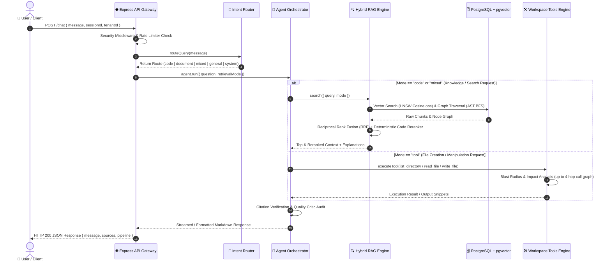
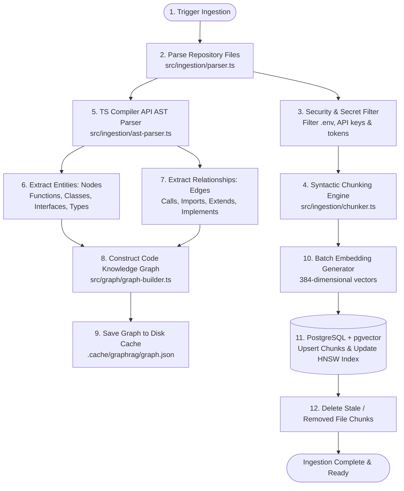
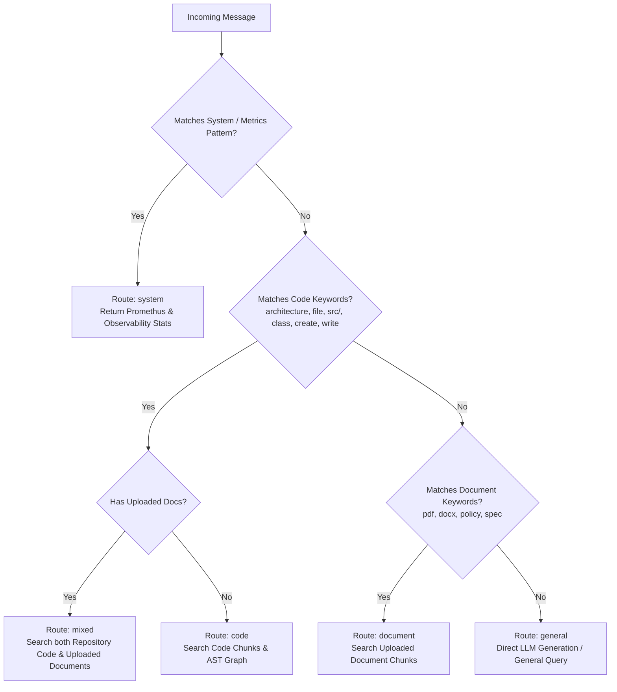
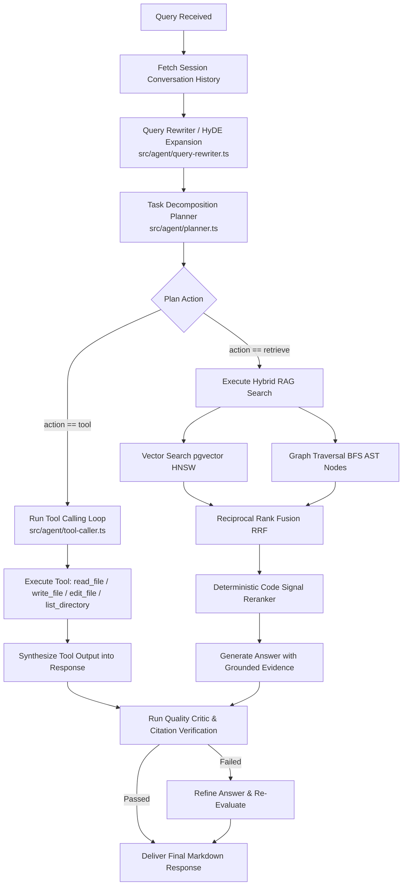
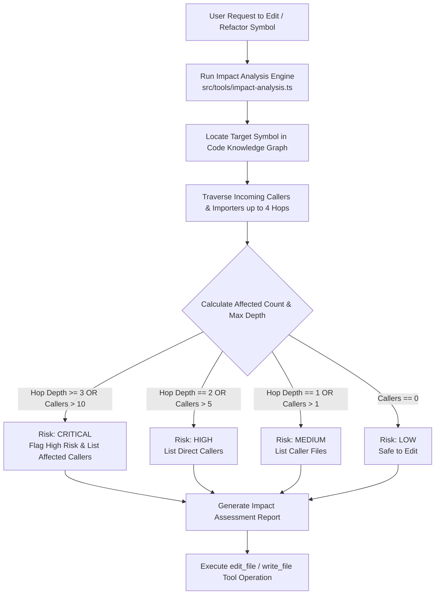

# 🔄 Comprehensive System & Development Workflow Documentation

This document outlines the end-to-end operational, architectural, data processing, multi-agent execution, and verification workflows for the **GraphRAG AI Chatbot System**.

---

## 📌 Workflow Overview & Sequence Map



---

## 1. Repository & AST Ingestion Workflow

This workflow executes on server startup or when triggered via indexing scripts (`npm run rag:indexer-test`).



### Key Stages:
1. **File Parsing**: Scans repository source files (`.ts`, `.js`, `.json`, `.md`).
2. **Secret Scrubbing**: Strips environment variables, `.env` entries, and credentials.
3. **AST Entity & Edge Extraction**: Uses TypeScript Compiler API to map full symbol call trees and dependency graphs without full compilation overhead.
4. **pgvector Storage**: Embeds code chunks and stores them in PostgreSQL with `VECTOR(384)` and HNSW cosine distance indexing (`SET LOCAL hnsw.ef_search = 100`).

---

## 2. Request Routing & Intent Classification Workflow

Every incoming HTTP request goes through deterministic classification before triggering LLM generation:



---

## 3. Autonomous Multi-Agent Loop Workflow



---

## 4. AST Impact Analysis & Code Mutation Safety Workflow

Before making destructive or structural changes to code files, the system executes static blast-radius impact analysis:



---

## 5. Multi-Tenant Document Upload Workflow

```mermaid
flowchart TD
    UploadReq[POST /api/documents/upload] --> AuthCheck[Verify Tenant ID & User ID Scope]
    AuthCheck --> ParseDoc[Multi-Format Document Parser\nsrc/ingestion/document-parser.ts]
    
    ParseDoc --> MimeCheck{File Format?}
    MimeCheck -->|PDF| PdfParse[pdf-parse / pdfjs-dist / OCR Tesseract]
    MimeCheck -->|DOCX| DocxParse[Mammoth Parser]
    MimeCheck -->|TXT / MD| TextParse[Plain Text Parser]

    PdfParse --> DocChunker[Document Chunker\nsrc/ingestion/document-chunker.ts]
    DocxParse --> DocChunker
    TextParse --> DocChunker
    
    DocChunker --> EmbedDoc[Generate Vector Embeddings 384-d]
    EmbedDoc --> StoreDoc[(Store in documents & document_chunks tables\nwith ON DELETE CASCADE & HNSW index)]
    StoreDoc --> UploadComplete[Return HTTP 200 { documentId, status: 'indexed' }]
```

---

## 6. Verification, Testing & Pipeline Commands

```powershell
# 1. Compile TypeScript Codebase
npm run build

# 2. Apply SQL Database Migrations
npm run db:migrate

# 3. Verify Database Pool & Resilience
npm run db:test

# 4. Verify Database Backup & Restore
npm run db:backup-test

# 5. Execute Security, Path Traversal & Secret Scrubbing Test
npm run rag:security-test

# 6. Test Batch Vector Embedding Engine
npm run rag:embed-test

# 7. Test Incremental Repository Indexer
npm run rag:indexer-test

# 8. Test System Input Guardrails & Token Limits
npm run rag:limits-test

# 9. Verify AST Blast Radius Impact Analysis
npm run tool:impact-analysis

# 10. Run End-to-End System Integration Test
npm run rag:integration-test

# 11. Run Retrieval Ablation Benchmark Matrix
npm run rag:ablation
```
